Nama : Zaenal Abidin Syah

Nim : 210411100186

Kelas : Pengembangan Aplikasi Terintegrasi A

# Dokumentasi Api

### <b>buat sub folder dengan nama t[nim]</b>

#### ssh ke server

buka terminal untuk mengakses ssh

```
ssh root@103.146.202.172
```

masukan password, dan jika berhasil maka akan seperti gambar berikut

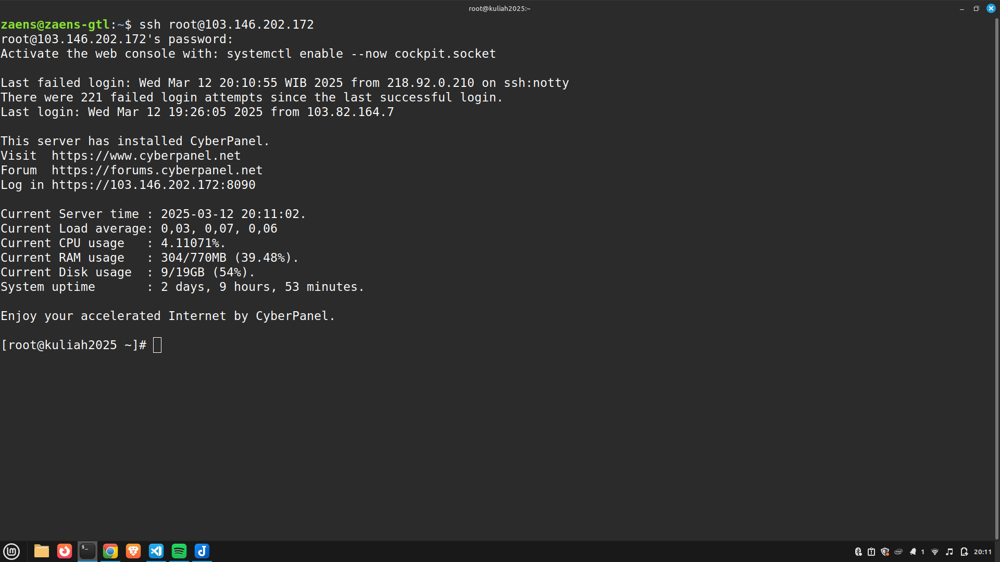

#### Membuat Subfolder

Setelah masuk ke vps melalui ssh, selanjutnya lakukan change directory atau cd ke /home/kuliah2025.my.id/public_html. Lalu ketikan perintah terminal mkdir untuk membuat directory baru, dan ls untuk menampilkan directory.

```
cd /home/kuliah2025.my.id/public_html/
mkdir t21-186
ls
```

dan hasilnya akan seperti gambar berikut

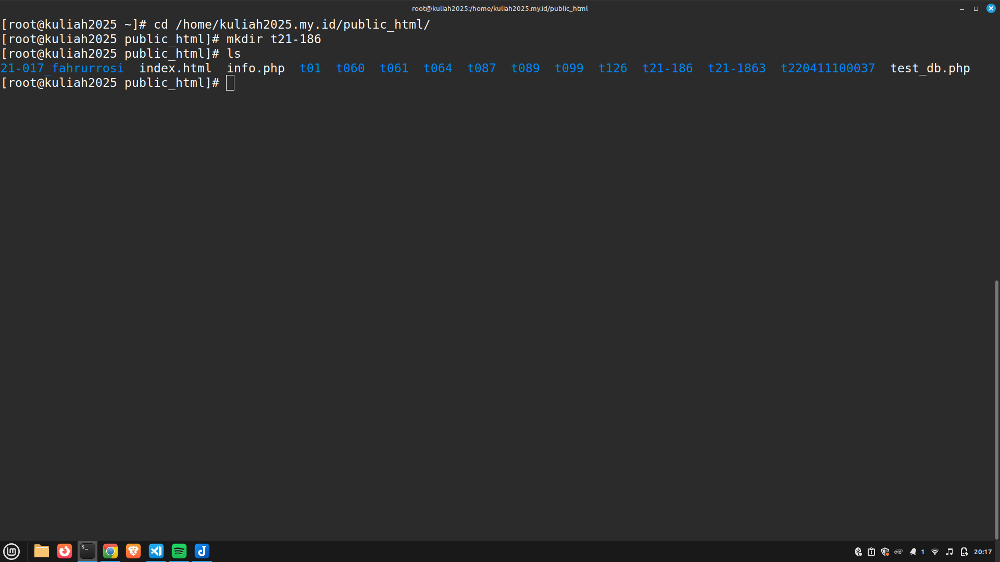

directory t21-186 adalah folder tempat code yang saya gunakan untuk membuat api, change directory ke folder tersebut

```
cd t21-186
```

membuat subfolder telah selesai, selanjutnya tinggal membuat file code api

### <b>buat file code apinya</b>

membuat file php dengan mengetikan perintah berikut

```
nano test.php
```

berikut setelah mengetikan perintah diatas

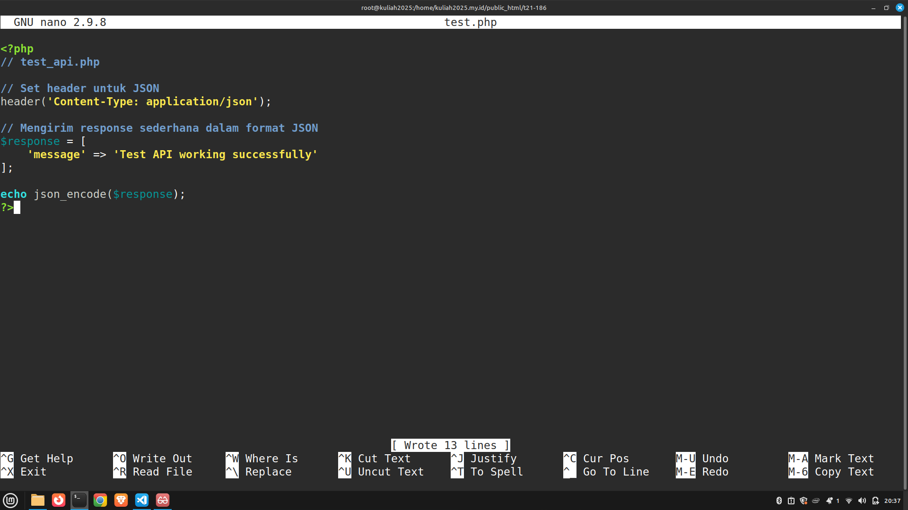

lalu masukan kode berikut

```php
<?php
// Set header untuk JSON
header('Content-Type: application/json');

// Mengirim response sederhana dalam format JSON
$response = [
    'message' => 'Test API working successfully'
];

echo json_encode($response);
?>
```

penjelasan code

```php
header('Content-Type: application/json');
```

code di atas digunakan untuk mengeset header agar server mengembalikan json.

```php
$response = [
    'message' => 'Test API working successfully'
];

echo json_encode($response);
```

code diatas untuk mengirimkan json berupa response yang didalamnya terdapat message 'Test API working successfully'

pembuatan file code api selesai dilanjutkan pengujian api menggunakan CURL dan Postman.

## <b>lakukan pengujian api</b>

ada beberap opsi untuk melakukan pengujian api seperti menggunakan CURL dan postman. Postman dapat digunakan untuk pengujian api dengan menggunakan Interface atau GUI. sementara CURL hanya dapat diakses melalui terminal saja. pengujian dilakukan dengan memasukan url dari api yaitu https://kuliah2025.my.id/t21-186/test.php

untuk menggunakan curl ketikan perintah berikut

```
curl https://kuliah2025.my.id/t21-186/test.php
```

akan didapatkan hasil seperti berikut

```json
{ "message": "Test API working successfully" }
```

berikut gambar hasil pengujian api menggunakan curl
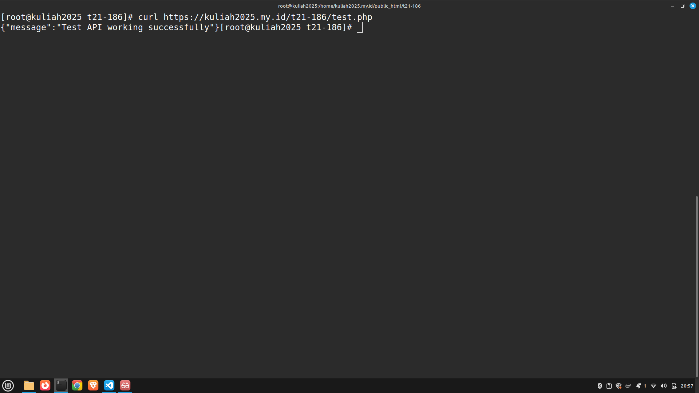

untuk menggunakan postman buka aplikasi postman
masukan url test api https://kuliah2025.my.id/t21-186/test.php, lalu pilih metode get lalu tekan send untuk mengirim request ke api. untuk pengujiannya dapat dilihat pada gambar berikut.
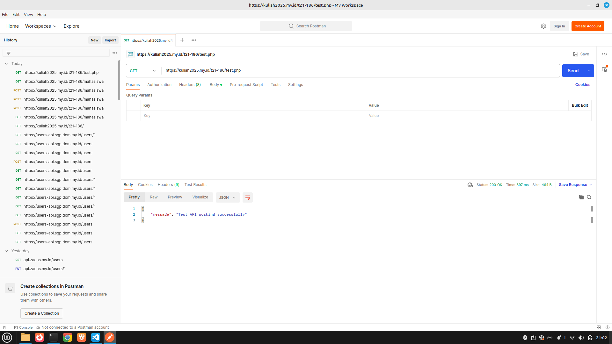

untuk melihat response dari server bisa dilihat di bagian bawah. server mengirimkan response json seperti berikut

```json
{
  "message": "Test API working successfully"
}
```

pengujian api berhasil dilakukan menggunakan CURL maupun postman. selanjut dapat membuat api yang terintegrasi dengan database.

## <b>membuat api (GET) dari database mysql,tabel mahasiswa, dengan parameter nama mahasiswa</b>

#### membuat database

masuk ke mysql untuk membuat database

```
mysql -u api_zaens -p
```

masukan password, jika berhasil makan akan tampil seperti gambar berikut
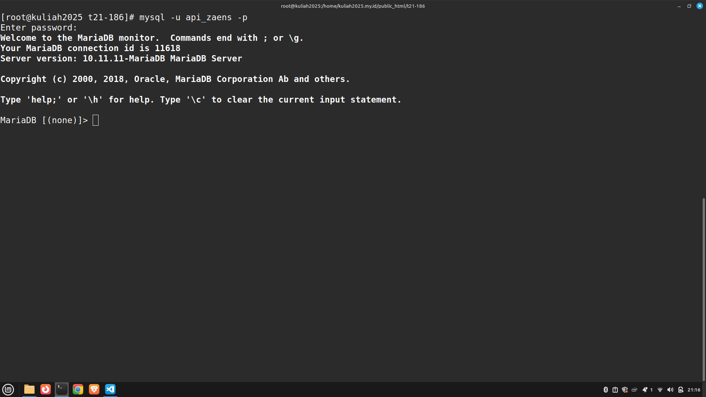

selanjutnya membuat database 21_mahasiswadatabase dengan perintah berikut

```sql
create database 21_mahasiswadatabase;
```

setelah membuat database selanjutnya membuat table mahasiswa

```
use 21_mahasiswadatabase;
```

setelah mengubah database ke 21_mahasiswadatabase selanjutnya membuat table mahasiswa dengan perintah berikut

```sql
CREATE TABLE `mahasiswa` (
  `id` int(11) NOT NULL AUTO_INCREMENT,
  `name` varchar(100) NOT NULL,
  `nim` varchar(20) NOT NULL,
  `email` varchar(100) NOT NULL,
  PRIMARY KEY (`id`)
)
```

hasilnya akan seperti gambar berikut
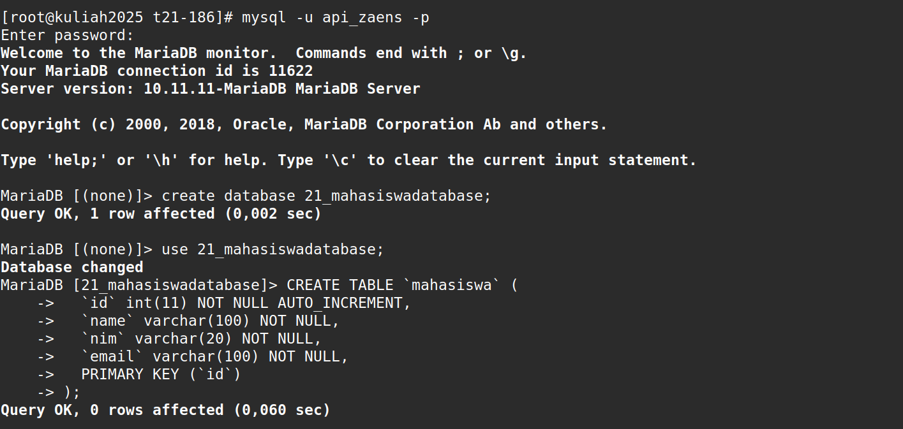

setelah membuat table mahasiswa selanjutnya isi table mahasiswa dengan perintah berikut

```sql
INSERT INTO mahasiswa(name, nim, email) VALUES
('Zaenal Abidin Syah','210411100186','210411100186@student.trunojoyo.ac.id'),
('Budi Santoso','210411100187','210411100187@student.trunojoyo.ac.id'),
('Citra Dewi','210411100188','210411100188@student.trunojoyo.ac.id'),
('Dewi Lestari','210411100189','210411100189@student.trunojoyo.ac.id'),
('Eko Prasetyo','210411100190','210411100190@student.trunojoyo.ac.id'),
('Fajar Hidayat','210411100191','210411100191@student.trunojoyo.ac.id'),
('Gita Permata','210411100192','210411100192@student.trunojoyo.ac.id'),
('Hendra Wijaya','210411100193','210411100193@student.trunojoyo.ac.id'),
('Indra Kurniawan','210411100194','210411100194@student.trunojoyo.ac.id'),
('Joko Susilo','210411100195','210411100195@student.trunojoyo.ac.id'),
('Kiki Amalia','210411100196','210411100196@student.trunojoyo.ac.id'),
('Lina Marlina','210411100197','210411100197@student.trunojoyo.ac.id'),
('Maman Subagyo','210411100198','210411100198@student.trunojoyo.ac.id'),
('Nina Puspita','210411100199','210411100199@student.trunojoyo.ac.id'),
('Oki Setiawan','210411100200','210411100200@student.trunojoyo.ac.id'),
('Putu Dwi','210411100201','210411100201@student.trunojoyo.ac.id'),
('Rina Sari','210411100202','210411100202@student.trunojoyo.ac.id'),
('Sari Wulandari','210411100203','210411100203@student.trunojoyo.ac.id'),
('Teguh Pratama','210411100204','210411100204@student.trunojoyo.ac.id'),
('Umar Hidayat','210411100205','210411100205@student.trunojoyo.ac.id');
```

perintah berikut akan menambahkan data mahasiswa sebanyak 20 data. hasilnya dapat dilihat dari gambar berikut

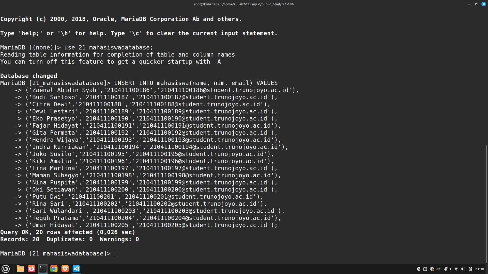

setelah membuat database, table mahasiswa dan insert mahasiswa berhasil selanjutnya membuat code yang berintegrasi dengan database mahasiswa.

#### code yang terintegrasi dengan database

buat file menggunakan nano dengan perintah berikut

```
nano index.php
```

lalu isi dengan code api dan hasilnya akan seperti gambar berikut
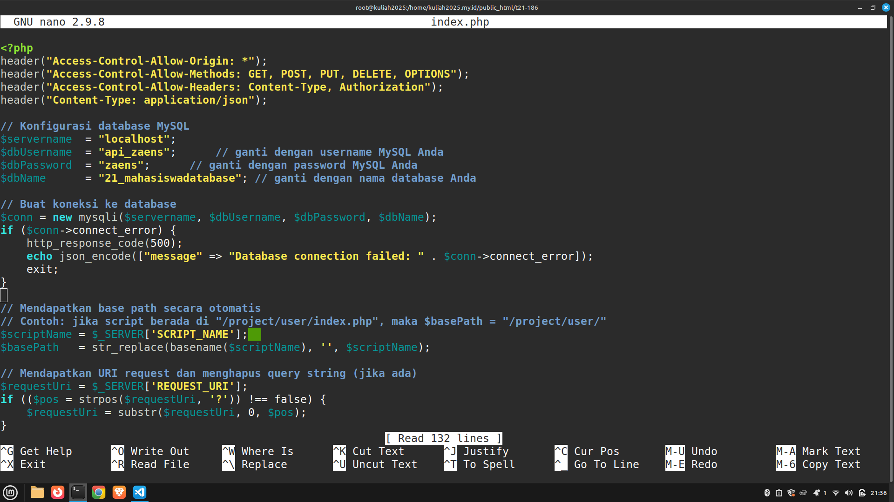

code api dari index.php adalah

```php
<?php
header("Access-Control-Allow-Origin: *");
header("Access-Control-Allow-Methods: GET, POST, PUT, DELETE, OPTIONS");
header("Access-Control-Allow-Headers: Content-Type, Authorization");
header("Content-Type: application/json");

// Konfigurasi database MySQL
$servername  = "localhost";
$dbUsername  = "zaens";      // ganti dengan username MySQL Anda
$dbPassword  = "zaens";      // ganti dengan password MySQL Anda
$dbName      = "mahasiswa"; // ganti dengan nama database Anda

// Buat koneksi ke database
$conn = new mysqli($servername, $dbUsername, $dbPassword, $dbName);
if ($conn->connect_error) {
    http_response_code(500);
    echo json_encode(["message" => "Database connection failed: " . $conn->connect_error]);
    exit;
}

// Mendapatkan base path secara otomatis
// Contoh: jika script berada di "/project/user/index.php", maka $basePath = "/project/user/"
$scriptName = $_SERVER['SCRIPT_NAME'];
$basePath   = str_replace(basename($scriptName), '', $scriptName);

// Mendapatkan URI request dan menghapus query string (jika ada)
$requestUri = $_SERVER['REQUEST_URI'];
if (($pos = strpos($requestUri, '?')) !== false) {
    $requestUri = substr($requestUri, 0, $pos);
}

// Hapus base path dari URI, jika ada
if (strpos($requestUri, $basePath) === 0) {
    $requestUri = substr($requestUri, strlen($basePath));
}

$requestUri = trim($requestUri, '/');
$segments   = explode('/', $requestUri);

// Cek apakah URL diawali dengan "users"
if (isset($segments[0]) && $segments[0] === 'mahasiswa') {
    if ($_SERVER['REQUEST_METHOD'] === 'GET') {
        $name = isset($segments[1]) ? urldecode(trim(strval($segments[1]))) : null;

        if ($name !== null) {
            $stmt = $conn->prepare("SELECT * FROM mahasiswa WHERE name = ?");
            $stmt->bind_param("s", $name);
            $stmt->execute();

            $result = $stmt->get_result();

            if ($result->num_rows > 0) {
                $user = $result->fetch_assoc();
                http_response_code(200);
                echo json_encode($user);
            } else {
                http_response_code(404);
                echo json_encode(["message" => "mahasiswa not found"]);
            }
            $stmt->close();
        } else {
            // Mengambil semua user
            $result = $conn->query("SELECT * FROM mahasiswa");
            $users  = [];
            while ($row = $result->fetch_assoc()) {
                $users[] = $row;
            }
            http_response_code(200);
            echo json_encode($users);
        }
    } elseif ($_SERVER['REQUEST_METHOD'] === 'POST') {
        // Mendapatkan data yang dikirim
        $data = json_decode(file_get_contents("php://input"), true);
        if (!isset($data["name"]) || !isset($data["nim"]) || !isset($data["email"])) {
            http_response_code(400);
            echo json_encode(["message" => "Please, fill name, nim, email!"]);
        } else {
            // Menambahkan user baru menggunakan prepared statement
            $stmt = $conn->prepare("INSERT INTO mahasiswa (name, nim, email) VALUES (?, ?, ?)");
            $stmt->bind_param("sss", $data["name"], $data["nim"], $data["email"]);

            if ($stmt->execute()) {
                $newId = $stmt->insert_id;
                http_response_code(201);
                echo json_encode(["message" => "mahasiswa added successfully!"]);
            } else {
                http_response_code(500);
                echo json_encode(["message" => "Server Error!" ]);
            }
            $stmt->close();
        }
    } elseif ($_SERVER['REQUEST_METHOD'] === 'PUT') {
        // Mendapatkan data yang dikirim
        $data = json_decode(file_get_contents("php://input"), true);
        $id = isset($segments[1]) ? intval($segments[1]) : null;

        // Memastikan data yang dibutuhkan tersedia

        if (!isset($id)){
            http_response_code(400);
            echo json_encode(["message" => "Membutuhkan parameter ID mahasiswa"]);
        }else if (!isset($data["name"]) || !isset($data["nim"]) || !isset($data["email"])) {
            http_response_code(400);
            echo json_encode(["message" => "please, fill name, nim and email!"]);
        } else {
            // Update data mahasiswa berdasarkan ID menggunakan prepared statement
            $stmt = $conn->prepare("UPDATE mahasiswa SET name = ?, nim = ?, email = ? WHERE id = ?");
            $stmt->bind_param("sssi", $data["name"], $data["nim"], $data["email"], $id);

            if ($stmt->execute()) {
                if ($stmt->affected_rows > 0) {
                    http_response_code(200);
                    echo json_encode(["message" => "Mahasiswa updated successfully!"]);
                } else {
                    http_response_code(404);
                    echo json_encode(["message" => "Update Mahasiswa failed!"]);
                }
            } else {
                http_response_code(500);
                echo json_encode(["message" => "Server Error!"]);
            }
            $stmt->close();
        }
    } else {
        http_response_code(405);
        echo json_encode(['message' => 'Method not allowed']);
    }
} else if (isset($segments[0]) && $segments[0] === '') {
  header("Content-Type: text/html");
?>
  <!DOCTYPE html>
  <html lang="en">

  <head>
    <meta charset="utf-8" />
    <meta name="viewport" content="width=device-width, initial-scale=1" />
    <meta name="description" content="SwaggerUI" />
    <title>SwaggerUI</title>
    <link rel="stylesheet" href="https://unpkg.com/swagger-ui-dist@5.11.0/swagger-ui.css" />
  </head>

  <body>
    <div id="swagger-ui"></div>
    <script src="https://unpkg.com/swagger-ui-dist@5.11.0/swagger-ui-bundle.js" crossorigin></script>
    <script>
      window.onload = () => {
        window.ui = SwaggerUIBundle({
          url: 'swagger.json',
          dom_id: '#swagger-ui',
        });
      };
    </script>
  </body>

  </html>
<?php
}
?>

<?php

$conn->close();
?>
```

untuk penjelasan code adalah sebagai berikut

```php
header("Access-Control-Allow-Origin: *");
header("Access-Control-Allow-Methods: GET, POST, PUT, DELETE, OPTIONS");
header("Access-Control-Allow-Headers: Content-Type, Authorization");
header("Content-Type: application/json");
```

Kode di atas digunakan untuk mengatur header HTTP pada API yang dibuat dengan PHP native.
Header "Access-Control-Allow-Origin: \*" memungkinkan akses dari semua domain, sedangkan "Access-Control-Allow-Methods" menentukan metode HTTP yang diperbolehkan.
Header "Access-Control-Allow-Headers" menetapkan jenis header yang diizinkan (seperti Content-Type dan Authorization), dan "Content-Type: application/json" memastikan bahwa respon dikirim dalam format JSON.

```php
// Konfigurasi database MySQL
$servername  = "localhost";
$dbUsername  = "zaens";      // ganti dengan username MySQL Anda
$dbPassword  = "zaens";      // ganti dengan password MySQL Anda
$dbName      = "mahasiswa"; // ganti dengan nama database Anda

// Buat koneksi ke database
$conn = new mysqli($servername, $dbUsername, $dbPassword, $dbName);
if ($conn->connect_error) {
    http_response_code(500);
    echo json_encode(["message" => "Database connection failed: " . $conn->connect_error]);
    exit;
}
```

Kode ini untuk menghubungkan server api dengan database MySQL menggunakan PHP native.
Pertama, mendefinisikan variabel untuk host, username, password, dan nama database, kemudian dibuat koneksi menggunakan mysqli.
Jika koneksi gagal, kode akan mengirimkan HTTP response dengan status 500 beserta pesan error dalam format JSON.

```php
// Mendapatkan base path secara otomatis
// Contoh: jika script berada di "/file/user/index.php", maka $basePath = "/file/user/"
$scriptName = $_SERVER['SCRIPT_NAME'];
$basePath   = str_replace(basename($scriptName), '', $scriptName);

// Mendapatkan URI request dan menghapus query string (jika ada)
$requestUri = $_SERVER['REQUEST_URI'];
if (($pos = strpos($requestUri, '?')) !== false) {
    $requestUri = substr($requestUri, 0, $pos);
}

// Hapus base path dari URI, jika ada
if (strpos($requestUri, $basePath) === 0) {
    $requestUri = substr($requestUri, strlen($basePath));
}

$requestUri = trim($requestUri, '/');
$segments   = explode('/', $requestUri);
```

Kode ini untuk melakukan secara otomatis menentukan base path dari file script, misalnya "/file/user/", dengan menghapus nama file dari \$\_SERVER['SCRIPT_NAME']. Selanjutnya, URI request diambil dari $\_SERVER['REQUEST_URI'] dan query string dihapus. Jika URI tersebut mengandung base path, maka bagian tersebut juga dihilangkan, kemudian URI di-trim dan dipecah menjadi segmen-segmen menggunakan explode('/'), yang memudahkan proses routing dalam aplikasi API.

```php
if (isset($segments[0]) && $segments[0] === 'mahasiswa') {
```

Koda ini memeriksa apakah segmen pertama dari URI ada dan bernilai "mahasiswa". Jika kondisi ini terpenuhi, maka aplikasi akan menjalankan logika khusus untuk menangani request yang berkaitan dengan entitas mahasiswa.

```php
else if (isset($segments[0]) && $segments[0] === '') {
  header("Content-Type: text/html");
?>
  <!DOCTYPE html>
  <html lang="en">

  <head>
    <meta charset="utf-8" />
    <meta name="viewport" content="width=device-width, initial-scale=1" />
    <meta name="description" content="SwaggerUI" />
    <title>SwaggerUI</title>
    <link rel="stylesheet" href="https://unpkg.com/swagger-ui-dist@5.11.0/swagger-ui.css" />
  </head>

  <body>
    <div id="swagger-ui"></div>
    <script src="https://unpkg.com/swagger-ui-dist@5.11.0/swagger-ui-bundle.js" crossorigin></script>
    <script>
      window.onload = () => {
        window.ui = SwaggerUIBundle({
          url: 'swagger.json',
          dom_id: '#swagger-ui',
        });
      };
    </script>
  </body>

  </html>
<?php
}
```

Kode ini memeriksa apakah segmen pertama dari URI adalah kosong. Jika kondisi tersebut terpenuhi, maka header konten diatur menjadi "text/html" dan halaman HTML yang berisi SwaggerUI ditampilkan. Halaman ini memuat file konfigurasi Swagger (swagger.json) untuk menampilkan dokumentasi API secara interaktif.

```php
$name = isset($segments[1]) ? $segments[1] : null;
```

Baris kode ini memeriksa apakah segmen kedua dari URI ada. Jika ada, nilainya diubah menjadi string dan disimpan dalam variabel $name. Jika tidak ada, maka $name akan bernilai null.

```php
if (isset($segments[0]) && $segments[0] === 'mahasiswa') {
    if ($_SERVER['REQUEST_METHOD'] === 'GET') {
        $name = isset($segments[1]) ? urldecode(trim(strval($segments[1]))) : null;

        if ($name !== null) {
            $stmt = $conn->prepare("SELECT * FROM mahasiswa WHERE name = ?");
            $stmt->bind_param("s", $name);
            $stmt->execute();
            $result = $stmt->get_result();

            if ($result->num_rows > 0) {
                $user = $result->fetch_assoc();
                http_response_code(200);
                echo json_encode($user);
            } else {
                http_response_code(404);
                echo json_encode(["message" => "mahasiswa not found"]);
            }
            $stmt->close();
        } else {
            $result = $conn->query("SELECT * FROM mahasiswa");
            $users  = [];
            while ($row = $result->fetch_assoc()) {
                $users[] = $row;
            }
            http_response_code(200);
            echo json_encode($users);
        }
    }
```

Jika ada parameter nama (mahasiswa/{name}), mencari mahasiswa berdasarkan nama menggunakan prepared statement.
Jika tidak ada parameter nama, mengembalikan semua data mahasiswa dalam bentuk JSON.

```php
elseif ($_SERVER['REQUEST_METHOD'] === 'POST') {
    $data = json_decode(file_get_contents("php://input"), true);
    if (!isset($data["name"]) || !isset($data["nim"]) || !isset($data["email"])) {
        http_response_code(400);
        echo json_encode(["message" => "Please, fill name, nim, email!"]);
    } else {
        $stmt = $conn->prepare("INSERT INTO mahasiswa (name, nim, email) VALUES (?, ?, ?)");
        $stmt->bind_param("sss", $data["name"], $data["nim"], $data["email"]);

        if ($stmt->execute()) {
            http_response_code(201);
            echo json_encode(["message" => "mahasiswa added successfully!"]);
        } else {
            http_response_code(500);
            echo json_encode(["message" => "Server Error!" ]);
        }
        $stmt->close();
    }
}
```

pada method Post, dapatkan terlebih dahulu data JSON dari request body. Jika data tidak lengkap (name, nim, email tidak ada), mengembalikan status 400 Bad Request. Jika lengkap, menambahkan data ke database menggunakan prepared statement. Mengembalikan status 201 Created jika berhasil, atau 500 Server Error jika gagal.

```php
elseif ($_SERVER['REQUEST_METHOD'] === 'PUT') {
    $data = json_decode(file_get_contents("php://input"), true);
    $id = isset($segments[1]) ? intval($segments[1]) : null;

    if (!isset($id)){
        http_response_code(400);
        echo json_encode(["message" => "Membutuhkan parameter ID mahasiswa"]);
    } else if (!isset($data["name"]) || !isset($data["nim"]) || !isset($data["email"])) {
        http_response_code(400);
        echo json_encode(["message" => "please, fill name, nim and email!"]);
    } else {
        $stmt = $conn->prepare("UPDATE mahasiswa SET name = ?, nim = ?, email = ? WHERE id = ?");
        $stmt->bind_param("sssi", $data["name"], $data["nim"], $data["email"], $id);

        if ($stmt->execute()) {
            if ($stmt->affected_rows > 0) {
                http_response_code(200);
                echo json_encode(["message" => "Mahasiswa updated successfully!"]);
            } else {
                http_response_code(404);
                echo json_encode(["message" => "Update Mahasiswa failed!"]);
            }
        } else {
            http_response_code(500);
            echo json_encode(["message" => "Server Error!"]);
        }
        $stmt->close();
    }
}

```

pada method Put Jika ID atau data tidak lengkap, mengembalikan 400 Bad Request. Memperbarui data mahasiswa berdasarkan ID dengan prepared statement. Mengembalikan 200 OK jika berhasil, atau 404 Not Found jika tidak ada perubahan.

```php
else {
    http_response_code(405);
    echo json_encode(['error' => 'Method not allowed']);
}
```

Kode di atas merupakan kondisi fallback yang menangani permintaan dengan metode HTTP yang tidak diizinkan. Jika request method tidak sesuai dengan kondisi yang telah ditangani (misalnya, GET atau POST), maka server akan mengembalikan response dengan status code 405 ("Method not allowed") dan pesan error dalam format JSON

#### pengujian api menggunakan curl dan postman

pengujian endpoin /mahasiswa
untuk menguji api url yang digunakan adalah https://kuliah2025.my.id/t21-186/mahasiswa/

untuk menguji api url yang digunakan adalah https://kuliah2025.my.id/t21-186/mahasiswa/{nama mahasiswa}

untuk menggunakan curl ketikan perintah berikut

```
curl https://kuliah2025.my.id/t21-186/mahasiswa/Zaenal+Abidin+Syah
```

akan didapatkan hasil seperti berikut

```json
{
  "id": 1,
  "name": "Zaenal Abidin Syah",
  "nim": "210411100186",
  "email": "210411100186@student.trunojoyo.ac.id"
}
```

berikut gambar hasil pengujian api menggunakan curl
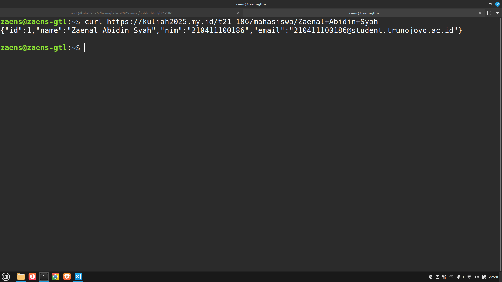

untuk menggunakan postman buka aplikasi postman
masukan url test api https://kuliah2025.my.id/t21-186/mahasiswa/Zaenal+Abidin+Syah, lalu pilih metode get lalu tekan send untuk mengirim request ke api. untuk pengujiannya dapat dilihat pada gambar berikut.
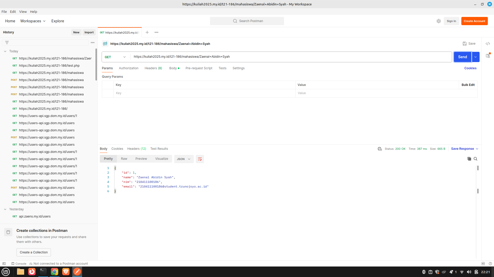

untuk melihat response dari server bisa dilihat di bagian bawah. server mengirimkan response json seperti berikut

```json
{
  "id": 1,
  "name": "Zaenal Abidin Syah",
  "nim": "210411100186",
  "email": "210411100186@student.trunojoyo.ac.id"
}
```
